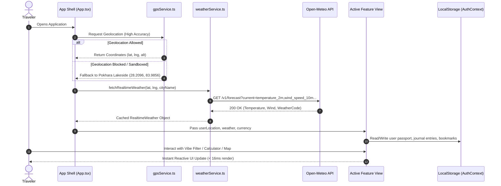
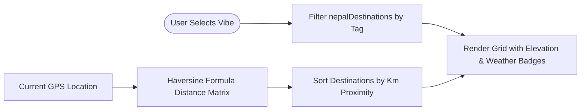
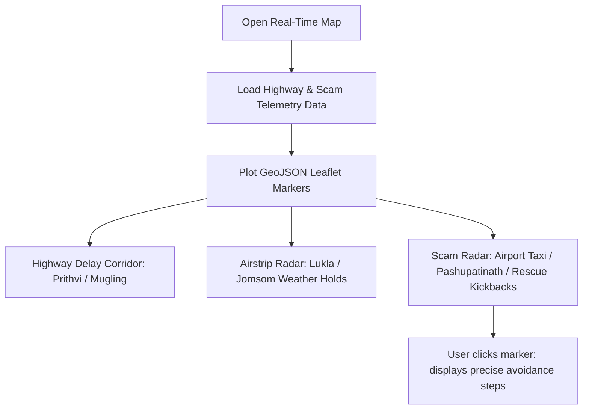
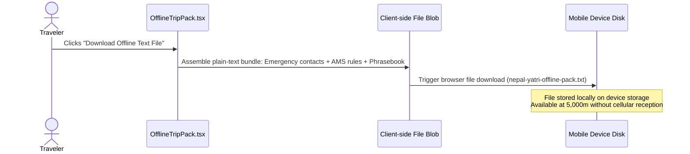

# Travel Mood — Project Architecture & Technical Documentation

> **Ethical, Real-Time Travel Intelligence, Transit Telemetry & OpenStreetMap Toolkit**

---

## 1. Executive Summary & Vision

**Travel Mood** is a specialized, ethical travel companion and ground intelligence platform engineered for travelers seeking authentic, mood-aligned exploration and reliable transit data.

Unlike conventional commercial booking engines that push rigid package tours and commission-heavy itineraries, Travel Mood is built on **community wisdom, transit safety, and practical ground truth**:
- **Atmospheric Discovery**: Matching travelers by *vibe* (Calm, Thrill, Heritage, Nature) and travel mood rather than generic city checklists.
- **OpenStreetMap Live Telemetry**: Full interactive OpenStreetMap (OSM) integration powered by Leaflet, displaying accurate nearby locations within a strictly bounded **30-minute drive** (~15km radius) alongside a live drive boundary circle overlay.
- **Real-Time Highway Delays & Transit Radar**: Live updates on mountain highway bottlenecks (e.g. Prithvi Highway widening, Nagdhunga pass) and domestic mountain airstrips (Lukla, Jomsom weather holds).
- **Traveler Protection**: Crowdsourced scam warning radar (fake helicopter rescue kickbacks, unlicensed high-altitude guides, unmetered taxi syndicates).
- **Ground Truth Anti-Guides**: Peer-reviewed "What to Skip vs. What to Do Instead" recommendations from travelers who returned within 30 days.
- **Mountain Survival & Offline Resilience**: A one-click downloadable emergency pack, realistic Dal Bhat altitude cost simulator, and procedural Web Audio soundscapes.

---

## 2. System Architecture Diagram

```mermaid
graph TB
    subgraph Client ["Client Layer (React 18 + TypeScript + Vite)"]
        UI["App Shell (App.tsx & ErrorBoundary)"]
        Nav["Navigation Bar & GPS Telemetry Header"]
        
        subgraph Views ["Application Feature Views"]
            VibeView["Vibe Finder & Nearby Suggestions"]
            AntiGuideView["Regret-Free Anti-Guides"]
            MapView["Real-Time Nepal Map (Leaflet)"]
            RemixView["Trip Remix Engine"]
            ShoulderView["Shoulder Season Calculator"]
            CommunityView["Community Hub (Local-For-A-Day & Returnee Q&A)"]
            CostView["True Cost & Mountain Inflation Calculator"]
            OfflineView["Offline Emergency Pack Generator"]
            JournalView["Living Travel Scrapbook"]
            SensoryView["Sensory Guide (Web Audio Synth)"]
            NicheView["Niche Angles (Slow Travel & Audits)"]
        end
        
        subgraph CoreServices ["Client Core Services & State"]
            AuthCtx["Auth Context (Passport, Personas & LocalStorage)"]
            GPSSvc["GPS Service (Haversine Distance & Hub Resolver)"]
            WeatherSvc["Weather Telemetry (Open-Meteo Integration)"]
            AudioSvc["Procedural Soundscape Engine (Web Audio API)"]
        end
    end

    subgraph ExternalServices ["External Telemetry & Data Sources"]
        OpenMeteo["Open-Meteo Weather Telemetry Engine"]
        GeoAPI["HTML5 Geolocation API / Fallback Engine"]
        OSMTiles["OpenStreetMap Cartographic Tile Servers"]
    end

    %% Connections
    UI --> Nav
    UI --> Views
    Views --> AuthCtx
    Views --> GPSSvc
    Views --> WeatherSvc
    SensoryView --> AudioSvc
    
    GPSSvc -.-> GeoAPI
    WeatherSvc -.-> OpenMeteo
    MapView -.-> OSMTiles
```



---

## 3. Component Hierarchy Tree

```
App (Root)
│
├── ErrorBoundary (Graceful sandbox and crash recovery)
│   └── AuthProvider (User session, personas, passports, saved destinations)
│       └── NepalAppContent
│           │
│           ├── Navbar
│           │   ├── Active Tab Selectors
│           │   ├── GPS Coordinate & Nearest Hub Badge
│           │   ├── Live Weather Telemetry Pill
│           │   ├── Currency Selector (NPR, USD, EUR, GBP, INR)
│           │   └── Traveler Passport Avatar / Persona Switcher
│           │
│           ├── LoginModal (Demo Personas: Maya Sherpa, David Chen, Aayush Maharjan)
│           │
│           ├── [View: vibes] VibeFinder
│           │   ├── Mood Selector (Calm, Thrill, Heritage, Nature)
│           │   ├── Suggested Nearby Places (GPS Distance Matrix)
│           │   └── Destination Cards with Altitude & Safety Advisories
│           │
│           ├── [View: anti-guides] AntiGuides
│           │   ├── Crowdsourced "Skip This vs. Do This Instead" Feed
│           │   ├── Vote/Helpful Counters
│           │   └── New Anti-Guide Submission Modal
│           │
│           ├── [View: map] RealTimeNepalMap
│           │   ├── Interactive Leaflet Map
│           │   ├── Highway Traffic Bottlenecks (Prithvi, Mugling, Nagdhunga)
│           │   ├── Flight Status Overlays (Lukla, Jomsom, Pokhara)
│           │   └── Crowdsourced Scam Radar & Preventive Advice
│           │
│           ├── [View: trip-remix] TripRemix
│           │   ├── Natural Language Route Input
│           │   ├── Sustainable/Cultural Filter Focus
│           │   └── Contextual Alternative Itinerary Generator
│           │
│           ├── [View: shoulder-season] ShoulderSeasonFinder
│           │   ├── 12-Month Comparative Calendar
│           │   ├── Precipitation vs. Crowd vs. Price Matrix
│           │   └── Upper Mustang Rain-Shadow Advisory
│           │
│           ├── [View: community] CommunityHub
│           │   ├── Tab 1: Local-For-A-Day Directory & Booking Inquiries
│           │   └── Tab 2: Ask a Returnee (<30 Days) Real-time Q&A Engine
│           │
│           ├── [View: cost-calc] TrueCostCalculator
│           │   ├── Trip Duration & Comfort Tier Sliders
│           │   ├── Geographic Region Selector (Cities vs. Annapurna vs. Khumbu vs. Mustang)
│           │   ├── Water Purification Plastic-Reduction Savings Engine
│           │   └── Itemized Price Breakdown (Altitude Dal Bhat inflation)
│           │
│           ├── [View: offline-pack] OfflineTripPack
│           │   ├── Emergency Helplines (Tourist Police, HRA, Red Cross)
│           │   ├── AMS / High-Altitude Emergency Protocol Rules
│           │   ├── Phonetic Devanagari Nepali Phrasebook
│           │   └── One-Click .txt Mountain Survival File Download
│           │
│           ├── [View: journal] LivingJournal
│           │   ├── Photo & Altitude Memory Logger
│           │   ├── Chronological Timeline Cards
│           │   └── Instant Story Sharing
│           │
│           ├── [View: sensory] SensoryGuide
│           │   ├── Acoustic, Olfactory & Tactile Profiles
│           │   └── Procedural Audio Synthesizer (Singing bowls, mountain wind)
│           │
│           ├── [View: niche] NicheAngles
│           │   ├── Verified Monthly Residences with Fiber Broadband
│           │   ├── Purpose-Driven Journeys (Artisan, Monastic, Biodiversity)
│           │   └── Inclusive Accessibility & Dietary Audits
│           │
│           └── Footer (Emergency helplines & tourist police dispatch)
```

---

## 4. State & Data Flow Diagram



---

## 5. Key Feature Workflows

### 5.1 Vibe & Nearest Hub Discovery


### 5.2 Real-Time Scam & Highway Delay Telemetry


### 5.3 Offline Mountain Kit Generation


---

## 6. Mathematical Models & Economic Formulas

### 6.1 Haversine Distance Formula
Used by `src/services/gpsService.ts` to calculate real-world distance from the traveler to Himalayan destinations:

$$d = 2r \arcsin \left( \sqrt{\sin^2\left(\frac{\Delta \phi}{2}\right) + \cos(\phi_1)\cos(\phi_2)\sin^2\left(\frac{\Delta \lambda}{2}\right)} \right)$$

Where:
- $r = 6,371 \text{ km}$ (mean radius of Earth)
- $\phi_1, \phi_2$ = latitudes in radians
- $\Delta \phi = \phi_2 - \phi_1$
- $\Delta \lambda = \lambda_2 - \lambda_1$

### 6.2 Mountain Altitude Inflation Simulator
Implemented in `src/components/TrueCostCalculator.tsx`. Unlike generic travel calculators that assume fixed costs, Nepal Yatri models altitude-dependent logistic supply overhead:

$$\text{Daily Total} = C_{\text{lodge}} + C_{\text{food}}(\text{alt}) + C_{\text{transport}} + \frac{C_{\text{permits}}}{\text{Days}} + C_{\text{extras}} - S_{\text{eco}}$$

- **Dal Bhat Altitude Surcharge**: Dal Bhat increases in cost from NPR 250 in low valleys up to NPR 1,200+ in high Khumbu (Gorak Shep, 5,164m) due to porter/yak haulage logistics.
- **Eco-Filter Savings ($S_{\text{eco}}$)**:
  $$S_{\text{eco}} = 400 \times \text{Days} \text{ (NPR)}$$
  Simulates saving ~NPR 400 per day by purifying glacial stream water instead of purchasing single-use bottled plastic in national parks.

---

## 7. Web Audio Procedural Soundscape Engine

Located in `src/services/audioSynth.ts`. Uses the browser's native **Web Audio API** without external audio assets:
1. **Tibetan Bronze Singing Bowl**: Sine wave oscillator at fundamental resonant frequencies (216 Hz, 432 Hz, 528 Hz) paired with an exponential gain decay curve to emulate bronze alloy ring down.
2. **Himalayan Mountain Wind**: Modulated white noise passed through a band-pass filter with a low-frequency oscillator (LFO) sweep simulating gusting ridge wind.
3. **Glacial Mountain Stream**: Pink noise filtered with rapid random cutoff shifts emulating moving water over stone.

---

## 8. Development, Linting & Build Verification

### Scripts
```bash
# Start local development server (bound to 0.0.0.0:3000)
npm run dev

# Run TypeScript type safety validations
npm run lint

# Production compilation
npm run build
```

### Technology Matrix
| Layer | Technology | Purpose |
| :--- | :--- | :--- |
| **Framework** | React 18 + Vite | Modular single-page application |
| **Language** | TypeScript | Strong typing across models, coordinates, and APIs |
| **Styling** | Tailwind CSS | Mobile-responsive dark Himalayan slate aesthetic |
| **Icons** | Lucide React | Clean, consistent vector iconography |
| **Maps** | Leaflet + OpenStreetMap | Interactive topographical maps with custom pins |
| **Audio** | Web Audio API | Procedural, zero-dependency ambient sound synthesis |
| **Weather** | Open-Meteo REST API | Live temperature, wind, and trekking condition metrics |
| **Offline** | Blob / Data URI | Zero-network downloadable survival text bundles |

---

## 9. Reliability & Error Recovery Design
- **Top-Level ErrorBoundary**: Wraps the root component to capture unexpected runtime rendering errors, providing a friendly "Reload Explorer" fallback.
- **Defensive Geolocation**: Wrapped inside `try/catch` and permission checks, defaulting safely to Pokhara Lakeside coordinates if geolocation is denied or running inside a restrictive iframe sandbox.
- **Zero-Crash API Fallbacks**: The AI Returnee Q&A engine and Trip Remixer feature built-in client-side synthesis when backend API servers are offline or unreachable.
